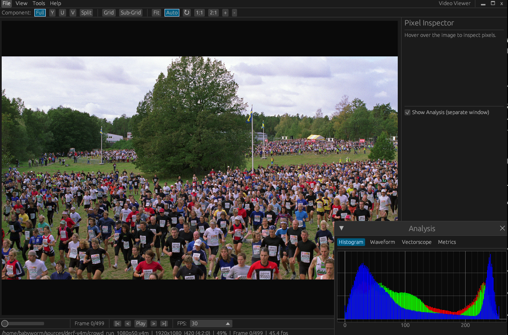

# Video Viewer

Raw/YUV/RGB video viewer built with Rust + egui. Supports 75+ pixel formats for inspecting uncompressed video data.



## Features

- **75+ pixel formats**: YUV (I420, NV12, NV21, YUY2, UYVY, P010, ...), RGB (RGB24, BGR24, RGB565, RGBA32, ...), Bayer (8/10/12/16-bit), Grayscale
- **Channel separation**: View individual Y/U/V or R/G/B channels with false color display
- **Split view**: 2x2 grid showing Full + 3 channels simultaneously (key `4`)
- **Keyboard shortcuts**: `0`-`4` for channel switching, `Space` for play/pause, arrow keys for navigation
- **A/B comparison**: Side-by-side, overlay, and diff modes for comparing two videos
- **Analysis tools**: Histogram, waveform, vectorscope, PSNR, SSIM
- **Pixel inspector**: Hover to see pixel values in all color spaces
- **Bookmarks & scene detection**: Mark frames and auto-detect scene changes
- **Y4M support**: Auto-detect parameters from Y4M headers (resolution, format, fps)
- **Smart auto-detection**: Resolution guessing from file size, filename metadata extraction (resolution, format, fps patterns)
- **Format conversion**: Convert between formats with background progress tracking
- **Frame export**: Save frames as PNG
- **BT.601 / BT.709**: Selectable YUV-RGB color matrix
- **Grid overlay**: Macroblock boundary overlay with configurable sizes (16/32/64/128)
- **Dark/Light theme**: Toggle with menu
- **Auto-fit**: Automatically fit image when window resizes
- **Custom title bar**: Integrated menu bar as window title bar

## Installation

### Pre-built binaries

Download the latest release for your platform from the [Releases](https://github.com/babyworm/video-viewer/releases) page:

| Platform | File |
|----------|------|
| Linux x86_64 | `video-viewer-linux-x86_64.tar.gz` |
| macOS Apple Silicon | `video-viewer-macos-aarch64.tar.gz` |
| macOS Intel | `video-viewer-macos-x86_64.tar.gz` |
| Windows x86_64 | `video-viewer-windows-x86_64.zip` |

Extract and run — no installation required.

### Build from source

#### Prerequisites

**Rust toolchain** (1.75+):

```bash
curl --proto '=https' --tlsv1.2 -sSf https://sh.rustup.rs | sh
```

**System dependencies:**

```bash
# Ubuntu / Debian
sudo apt install libopencv-dev clang libxcb-render0-dev libxcb-shape0-dev \
  libxcb-xfixes0-dev libxkbcommon-dev libssl-dev libgtk-3-dev

# Fedora
sudo dnf install opencv-devel clang-devel libxcb-devel libxkbcommon-devel \
  openssl-devel gtk3-devel

# Arch Linux
sudo pacman -S opencv clang libxcb libxkbcommon openssl gtk3

# macOS
brew install opencv llvm
```

#### Build

```bash
cd rust
cargo build --release

# Binary at rust/target/release/video-viewer
```

#### Run directly

```bash
cd rust
cargo run --release -- input.y4m
```

## Usage

### GUI mode

```bash
# Auto-detect parameters (Y4M)
video-viewer input.y4m

# Specify parameters (raw YUV)
video-viewer input.yuv -W 1920 -H 1080 --format I420
```

### Headless conversion

```bash
video-viewer input.yuv -W 1920 -H 1080 --vi I420 --vo NV12 -o output.nv12
```

### CLI Options

| Option | Description |
|--------|-------------|
| `<INPUT>` | Input file path |
| `-W`, `--width` | Video width |
| `-H`, `--height` | Video height |
| `-f`, `--format` | Pixel format (e.g., I420, NV12) |
| `--vi` | Input format (for conversion) |
| `--vo` | Output format (for conversion) |
| `-o`, `--output` | Output file path (triggers headless mode) |

### Keyboard Shortcuts

| Key | Action |
|-----|--------|
| `Space` | Play / Pause |
| `Left` / `Right` | Previous / Next frame |
| `Home` / `End` | First / Last frame |
| `0` | Full (all channels) |
| `1` | Channel 1 (Y/R) |
| `2` | Channel 2 (U/G) |
| `3` | Channel 3 (V/B) |
| `4` | Split view (2x2) |
| `F` | Fit to view |
| `G` | Cycle grid overlay (off/16/32/64/128) |
| `B` | Toggle bookmark |
| `Ctrl+O` | Open file |
| `Ctrl+S` | Save frame as PNG |
| `Ctrl+C` | Copy frame to clipboard |
| `Ctrl+Q` | Quit |

## Supported Formats

### YUV Planar
I420, YV12, YUV422P, YUV411P, YUV444P, YUV410, YVU410, YUV420M, YUV422M

### YUV Semi-Planar
NV12, NV21, NV16, NV61, NV24, NV42, P010, P016, NV12M, NV21M

### YUV Packed
YUYV, UYVY, YVYU, VYUY, Y41P, AYUV, VUYA, Y210

### RGB
RGB332, RGB444, ARGB444, XRGB444, RGB555, ARGB555, XRGB555, RGB565, RGB555X, RGB565X, BGR24, RGB24, BGR32, RGB32, ABGR32, ARGB32, BGRA32, RGBA32, XBGR32, XRGB32, BGRX32, RGBX32, HSV24, HSV32

### Bayer
RGGB, BGGR, GBRG, GRBG (8/10/10-packed/12/16-bit variants = 20 formats)

### Grayscale
Greyscale 8-bit, 10-bit, 12-bit, 16-bit

## Dependencies

| Crate | License | Purpose |
|-------|---------|---------|
| eframe / egui | Apache-2.0 OR MIT | GUI framework |
| egui_plot | Apache-2.0 OR MIT | Plot widgets (histogram, waveform, vectorscope) |
| opencv | MIT | Image processing, color conversion |
| clap | Apache-2.0 OR MIT | CLI argument parsing |
| memmap2 | Apache-2.0 OR MIT | Memory-mapped file I/O |
| rayon | Apache-2.0 OR MIT | Parallel processing |
| image | Apache-2.0 OR MIT | Image encoding (PNG export) |
| arboard | Apache-2.0 OR MIT | Clipboard support |
| lru | MIT | Frame cache |
| ndarray | Apache-2.0 OR MIT | N-dimensional array operations |
| parking_lot | Apache-2.0 OR MIT | Synchronization primitives |
| crossbeam | Apache-2.0 OR MIT | Concurrent data structures |
| serde / toml | Apache-2.0 OR MIT | Settings persistence |
| log / env_logger | Apache-2.0 OR MIT | Logging |

All dependencies are compatible with the MIT license.

## Development

```bash
cd rust

# Run all tests
cargo test

# Run specific test
cargo test test_pixel_info_yuyv

# Build in debug mode (faster compile)
cargo build

# Check without building
cargo check
```

### Project Layout

```
rust/
├── src/
│   ├── main.rs          # CLI entry point (clap)
│   ├── lib.rs           # Library root, GUI launch
│   ├── app.rs           # Main app state, shortcuts, frame logic
│   ├── core/            # Format definitions, reader, cache, hints, Y4M, pixel
│   ├── ui/              # Canvas, toolbar, sidebar, dialogs, comparison
│   ├── analysis/        # Histogram, waveform, vectorscope, metrics, scene
│   └── conversion/      # Format converter, chroma resampling
├── tests/               # Integration tests (110 tests)
scripts/
└── generate_test_data.py  # Test data generator (Python/OpenCV)
test_data/                 # Sample QCIF files (I420, NV12, RGB565, YUYV)
```

## Contributing

Contributions are welcome! Please follow these guidelines:

1. **Fork & branch**: Create a feature branch from `main`.
2. **Build & test**: Ensure `cargo build` and `cargo test` pass with no failures.
3. **Code style**: Follow Rust conventions (`cargo fmt`, `cargo clippy`).
4. **Commit messages**: Use concise, descriptive messages (e.g., "Add YVYU pixel inspector support").
5. **One concern per PR**: Keep pull requests focused on a single feature or fix.

### Adding a new pixel format

1. Add a `FormatEntry` to `FORMAT_DEFS` in `rust/src/core/formats.rs`.
2. Handle decoding in `rust/src/core/reader.rs` (`convert_to_rgb`, `get_channels`).
3. Handle pixel inspection in `rust/src/core/pixel.rs` (`get_pixel_info`).
4. If needed, add conversion support in `rust/src/conversion/converter.rs`.
5. Add tests in `rust/tests/` covering frame_size, pixel info, and conversion.

### Reporting issues

Open an issue on GitHub with:
- Steps to reproduce
- Input file format and resolution
- Expected vs actual behavior
- OS and Rust version (`rustc --version`)

## License

MIT License. See [LICENSE](LICENSE) for details.
